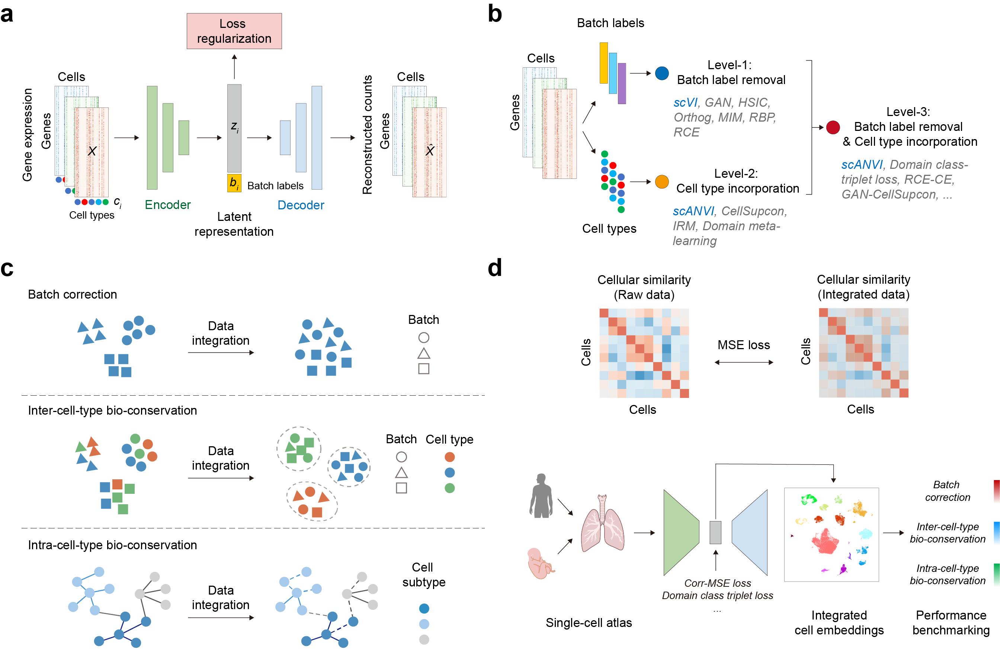

# scIB-E: Benchmarking deep learning methods for biologically conserved single-cell integration.

**scIB-E** is a comprehensive deep learning-based benchmarking framework for evaluating single-cell RNA sequencing (scRNA-seq) data integration methods. 

- **Unified Benchmarking Framework**:
  - Evaluates 16 deep-learning single-cell integration methods using a unified variational autoencoder (VAE) framework.
  - Incorporates batch information, cell-type labels, and combined strategies across three integration levels.

- **Refined Metrics for Intra-cell-type Variation**:
  - Extends the single-cell integration benchmarking (scIB) metrics by adding new metrics to better capture intra-cell-type biological conservation.

- **Novel Loss Function**:
  - Introduces **Corr-MSE Loss**, a correlation-based loss function designed to preserve global cellular relationships and enhance intra-cell-type biological variation.



The manuscript has been pre-printed in bioRxiv:

> Yi, Chenxin, Jinyu Cheng, Wanquan Liu, Junwei Liu, and Yixue Li. "Benchmarking deep learning methods for biologically conserved single-cell integration." bioRxiv (2024).
> https://doi.org/10.1101/2024.12.09.627450

---

## Installation

To use scIB-E, ensure you have Python 3.9 or higher. Install the required dependencies using:
```bash
pip install -r requirements.txt
```

---

## Usage

### 1. Preprocess Data
Preprocess your raw single-cell RNA-seq datasets before integration using:
```bash
python data_preprocess.py
```

### 2. Run Integration Methods
Use `main.py` to benchmark specific integration methods across the three levels:
```bash
python main.py
```

The following table summarizes the constraint settings for different methods:

| Level      | Methods               | batch_constraint      | celltype_constraint       | batch_celltype_constraint   |
|------------|-----------------------|-----------------------|---------------------------|-----------------------------|
| baseline   | scVI                  | None                  | None                      | /                           |
| Level-1    | GAN                   | "GAN"                 |                           |                             |
|            | HSIC                  | "HSIC"                |                           |                             |
|            | MIM                   | "MIM"                 |                           |                             |
|            | Orthog                | "Orthog"              |                           |                             |
|            | RBP                   | "RBP"                 |                           |                             |
|            | RCE                   | "RCE"                 |                           |                             |
| Level-2    | CellSupcon            | None                  | "CellSupcon"              |                             |
|            | Domain_meta_learning  |                       | "Domain_meta_learning"    |                             |
|            | IRM                   |                       | "IRM"                     |                             |
| Level-3    | DomainClassTripletLoss| /                     | /                         | "DomainClassTripletLoss"   |
|            | HSIC-CellSupcon       | "HSIC"                | "CellSupcon"              | /                           |
|            | MIM-CellSupcon        | "MIM"                 | "CellSupcon"              |                             |
|            | Orthog-CellSupcon     | "Orthog"              | "CellSupcon"              |                             |
|            | RBP-CellSupcon        | "RBP"                 | "CellSupcon"              |                             |
|            | RCE-CE                | "RCE"                 | "CE"                      |                             |
|            | RCE-CellSupcon        | "RCE"                 | "CellSupcon"              |                             |

### Datasets Used
- **Immune Dataset**: [Download](https://figshare.com/articles/dataset/Benchmarking_atlas-level_data_integration_in_single-cell_genomics_-_integration_task_datasets_Immune_and_pancreas_/12420968)
- **Pancreas Dataset**: [Download](https://figshare.com/projects/scPoli_data/155018)
- **Bone Marrow Mononuclear Cells (BMMC)**: Gene Expression Omnibus (GEO), accession number GSE194122
- **Human Lung Cell Atlas (HLCA) core**: [Download](https://cellxgene.cziscience.com/collections/6f6d381a-77014781-935c-db10d30de293)
- **Human Fetal Lung Cell Atlas**: [Download](https://fetallung.cellgeni.sanger.ac.uk/scRNA.html)

---

This repository will be continuously updated during the submission process.
